# Pairup 介紹

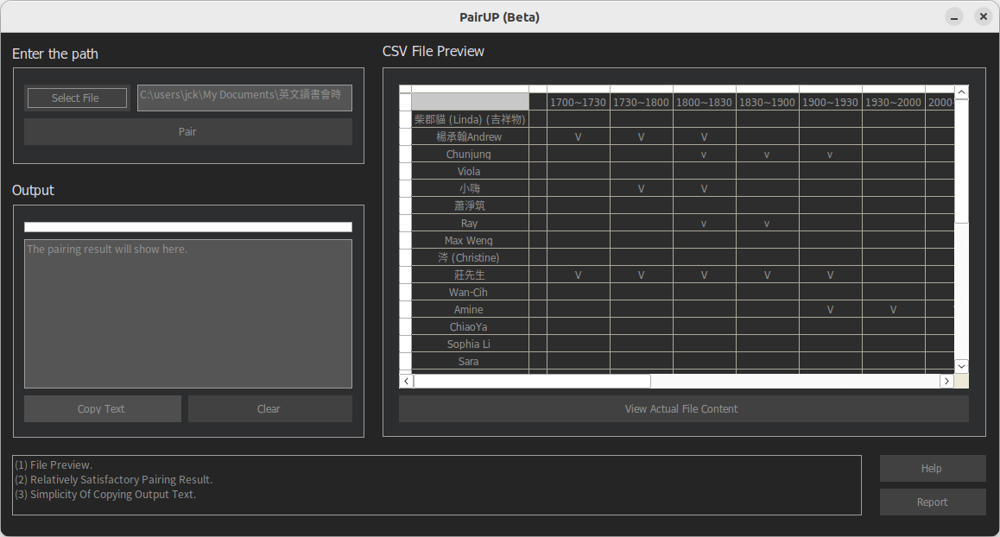

PairUP : [https://drive.google.com/file/d/1jlEPmmsfBskAG1rD3HukkOJUYH-lc21N/view?usp=sharing](https://drive.google.com/file/d/1jlEPmmsfBskAG1rD3HukkOJUYH-lc21N/view?usp=sharing)

## 開發緣起

為了解決英文口說讀書會 練習人數多、想練兩次的人數多時，在人工配對上的麻煩。
開發PairUP是希望藉由此程式，加速、有效率的達成每日配對的工作。
此程式要達成的目標為，利用電腦自動比對，直接產出一個最佳配對結果。（沒被配對到的人最少）

程式目前僅支持**Windows系統**(.NET Framework >= 4.0)；並將於未來以.NET MAUI框架開發，推出MacOS版本、或網頁版。

## 使用說明

### STEP 1

若您使用的系統為Windows，前往[此處](https://drive.google.com/file/d/1jlEPmmsfBskAG1rD3HukkOJUYH-lc21N/view?usp=sharing)，下載應用程式壓縮檔 (985KB)。
將`pairup.zip`檔解壓縮後，打開`pairup`資料夾，雙擊`pairup.exe`。

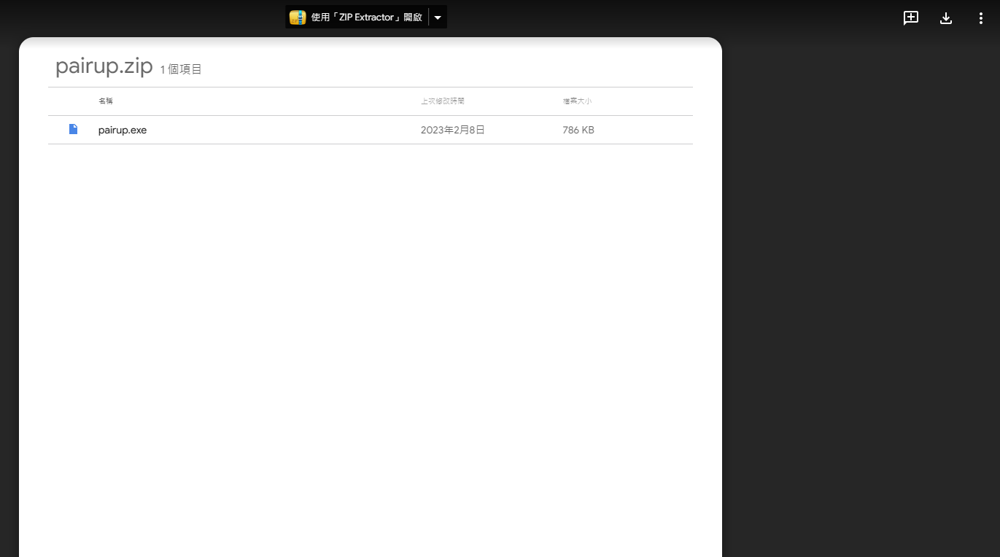
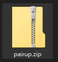
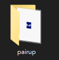
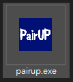

### STEP 2

將當日需要被配對的google sheet，下載成**.csv**格式，並儲存到電腦中。

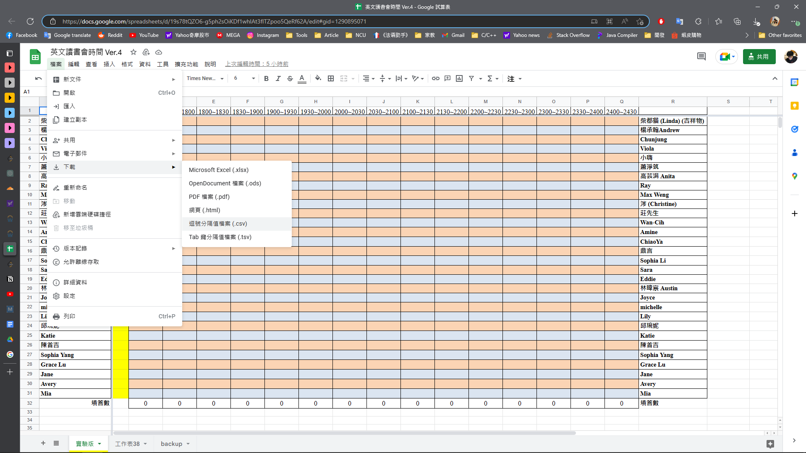

### STEP 3

在"Enter the path"區塊下，點擊"Select File"以開啟檔案總管，選擇剛剛儲存的**.csv**檔；您也可以選擇手動輸入路徑。完成上述步驟後點擊"Pair"按鈕。

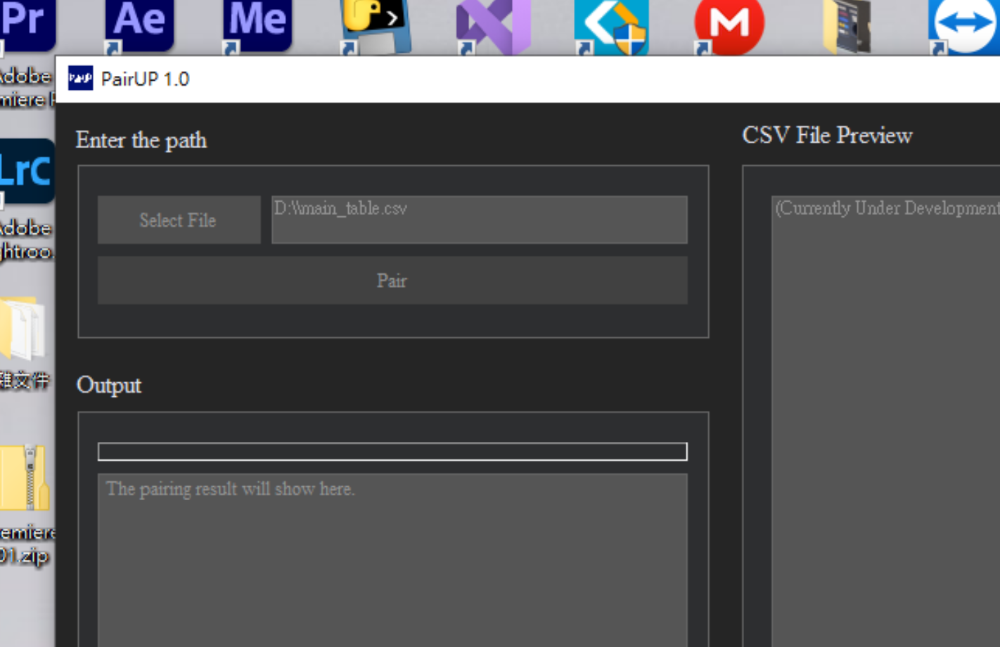

如果畫面出現此警告，那可能是因為路徑的錯誤，或是檔案已經損毀，您可以嘗試重新選擇另一個檔案。

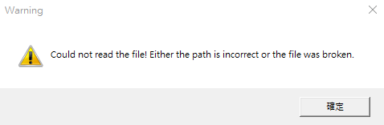

如果畫面出現此提示，代表配對成功。
值得一提的是，在配對的過程中，所有配對的可能性都已加入考慮，形成一個最佳結果；但若您不滿意此配對結果，則可以重複點擊"Pair"重新產生新結果。

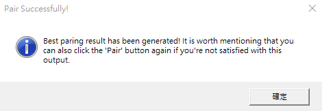

### STEP 4

在"Output"區塊下可以查看配對結果，可以直接點擊"Copy Text"將結果複製；或是點擊"Clear”，將結果清除。值得一提的是，有時配對結果字數過多，無法在文字框內全部顯示。此時，可以點擊文字框內任一處，並使用方向鍵查看未顯示的部分。

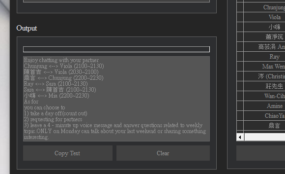

### Extra

點擊"Help"可開啟此介紹頁面。
當您發現此程式有Bug，也可以點擊"Report"，協助此程式的改進。（Program’s bugs, English grammar……）

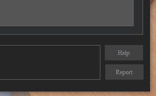

如果沒有出現錯誤訊息，則傳送成功。
開發者端即會收到類似訊息......

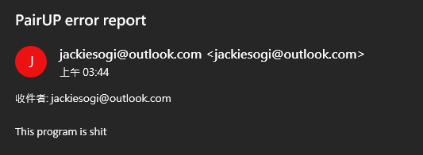